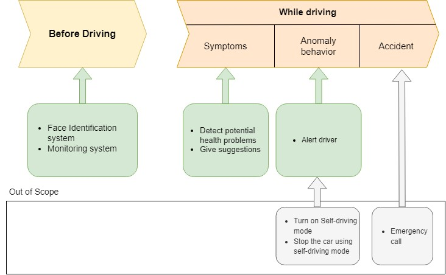
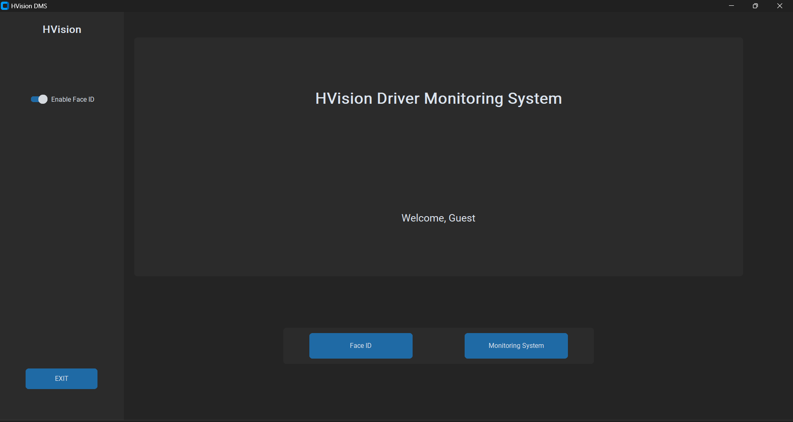
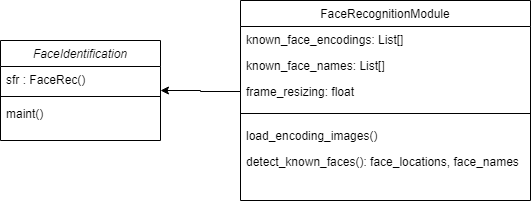
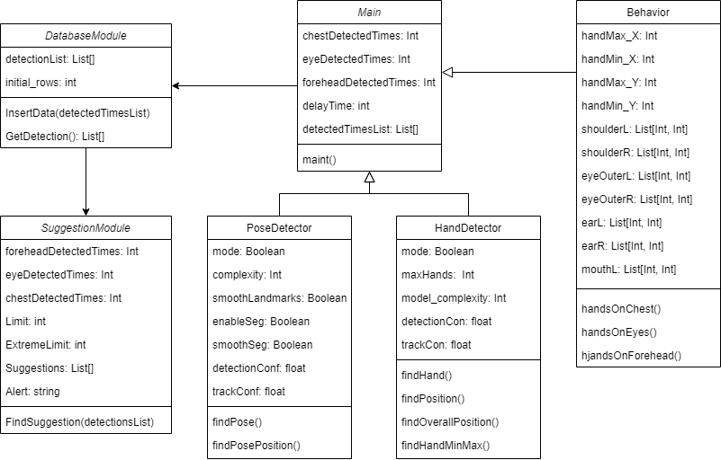

# HVision - Advanced Driver Monitoring System


**HVision** is a project undertaken as part of BSc (Hons) Business
Information Systems Degree, Westminster International University in Tashkent. 

**HVision** is designed to eliminate fatal consequences of evolving professional drivers due to health problems such as stroke or heart attack. Using Driving Monitoring System, HVision offers health problem identification system and suggestion system according to symptoms. It can alert the user if it identifies dangerous action by the driver. Application also offers face identification system as an optional module to the project. 


## Installation

Use the package manager [pip](https://pip.pypa.io/en/stable/) to install all required packages.

```bash
pip install -r requirements.txt
```

## Usage
### Monitoring System (Main)
Main monitoring system consists of 6 parts: Hand detection module, Pose detection module, Behavior detection module, Database module, Suggestion module and Speech recognition module. 

1. **Hand Detection Module** - it draws a box to hand using maximum and minimum points in X and Y axis and returns those values using findHandMinMax function.
2. **Pose Detection Module** - it takes position of shoulder, eyes, and ears for further calculations.
3. **Behavior Detection Module** - it is responsible for all calculation and detections, it returns true if hands were detected within chest, eyes, or forehead. Also, it has to be mentioned that optimizer values were added after multiple testing phases in Behavior module to detect forehead and optimize chest value. 
4. **Database Module** - The database module is responsible for adding detected times each 3 second into the detections table in “detection” local database.
5. **Suggestion Module** - All suggestion are located in this module. The suggestion module has two types of limit parameters, one is for simple suggestions, the second type is called Extreme Limit which is considered for alerting the user. 
6. **Speech Recognition Module** - It is required to perform NLP tasks after getting dangerous actions. It can take two parameters *offline_mode=True* to use the speech recognition system in offline mode and *offline_mode=False* for online use. 

### Face Recognition System (optional)
- Separately from the main function, *FaceRecognitionModule* class was developed. It stores all face images in folder **“Faces”** and allocates names to the faces according to their filename in the folder. When script starts, it loads all faces from the folder and stores in the list in encoded format, after loading all images it compares real-time video capture from camera and only if it detects face it starts computation. 

- **Compare_faces** function has hyperparameter called tolerance, change that values accuracy when comparing faces can be changed. 

## Images
### Logic

### UI

### FaceID System

### Monitoring System

## License

 All the rights belongs to Westminster International University in Tashkent and Samandar Olimjonov 2023.
